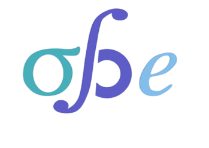
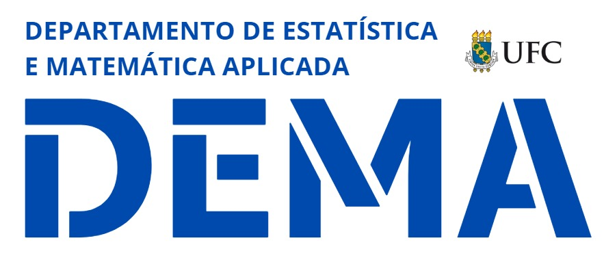
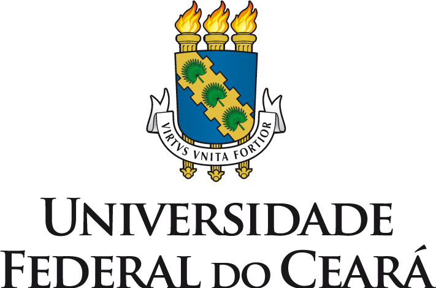
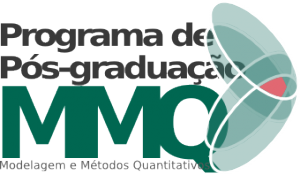

::: {#hero}

::: {.bloco-destaque}

O StatLab é um espaço de inovação que integra <strong>pesquisa, ensino e extensão</strong>, promovendo o uso da Estatística e da Ciência de Dados para gerar impacto na sociedade. Desenvolvemos soluções baseadas em dados para desafios contemporâneos.

Dados que geram decisões. Estatística que gera impacto.

<a href="./projects/" class="botao-statlab">Conheça nossos projetos e ações</a>
:::

::: {.aviso-destaque}
**📢 Notícias**

- **(20.03.2026)** StatLab torna-se parceiro da Olimpíada Brasileira de Estatística (OBE) e reforça o incentivo à divulgação da Estatística nas escolas.  

- **(26.01.2026)** StatLab teve aprovadas duas ações pela PREX/UFC, uma ACCS e um projeto de extensão, com bolsas e participação de cerca de 30 discentes. 

- **(18.06.2024)** StatLab passa a integrar o Diretório dos Grupos de Pesquisa do CNPq.
:::

:::

## 🔬 Linhas de Atuação {.test}

::: {.grid}

::: {.g-col-12 .g-col-md-6}
::: {.bloco-claro}
### 🌍 Extensão e Integração com a Sociedade

O StatLab desenvolve ações de extensão voltadas à interação entre universidade e sociedade, promovendo a construção conjunta de soluções baseadas em dados. As atividades incluem projetos de extensão, Ações Curriculares em Comunidades de Saberes (ACCS), oficinas, cursos e desenvolvimento de soluções aplicadas, envolvendo estudantes, instituições e comunidades em processos de troca de saberes, formação e impacto social.

:::
:::

::: {.g-col-12 .g-col-md-6}
::: {.bloco-claro}
### 💻 Analytics e Soluções em Dados

O StatLab atua no desenvolvimento de soluções baseadas em dados para apoiar a tomada de decisão em organizações públicas e privadas. A partir da análise de dados reais, são construídos diagnósticos, modelos estatísticos e soluções computacionais voltadas à resolução de problemas em diferentes áreas, promovendo impacto prático e mensurável. O laboratório mantém diálogo contínuo com instituições interessadas em parcerias para desenvolvimento de projetos aplicados.

:::
:::

::: {.g-col-12 .g-col-md-6}
::: {.bloco-claro}
### 🤖 Modelagem Estatística e Aprendizado

O StatLab desenvolve pesquisa em modelagem estatística e aprendizado de máquina, com ênfase em modelos de regressão e suas extensões, inferência estatística, diagnóstico de modelos e análise de dados complexos. Essas metodologias são aplicadas tanto em problemas teóricos quanto em contextos práticos, contribuindo para o avanço científico e para o desenvolvimento de soluções inovadoras baseadas em dados.

:::
:::

::: {.g-col-12 .g-col-md-6}
::: {.bloco-claro}
### 📣 Divulgação e Formação em Dados

O StatLab promove ações de divulgação científica e formação em Estatística e Ciência de Dados, por meio da produção de materiais acessíveis, cursos, eventos e iniciativas educacionais. Essas atividades contribuem para a ampliação da cultura de dados, estimulando o pensamento crítico e o uso qualificado da informação na sociedade.

:::
:::

:::

## 🤝 Parceiros {.test}

::: {.grid}

::: {.g-col-6 .g-col-md-4}

:::

:::

## 🏛️ Apoio {.test}

::: {.grid}

::: {.g-col-6 .g-col-md-4}

:::

::: {.g-col-6 .g-col-md-4}

:::

::: {.g-col-6 .g-col-md-4}

:::

::: {.g-col-6 .g-col-md-4}

:::

::: {.g-col-6 .g-col-md-4}

:::

::: {.g-col-6 .g-col-md-4}

:::

:::